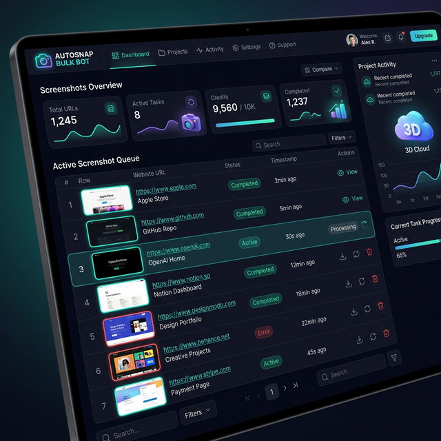

# ⚡ AutoSnap Bulk Bot

**AutoSnap Bulk Bot** is a high-speed, cloud-based website screenshot tool designed for developers and SEO professionals. Simply provide a list of URLs, and get full-page, high-resolution screenshots delivered straight to your Google Drive in seconds.

---

## 🌟 Key Features
- 🚀 **Cloud-Powered:** Runs entirely on Google Colab—no local setup needed.
- 📸 **Bulk Processing:** Snapshot 50+ websites in minutes.
- 💾 **Drive Integration:** Automatic backup to your Google Drive.
- 🖥️ **Full-Page Support:** Captures the entire height of the page, not just the viewport.
- 🛠️ **Customizable:** Choose resolutions, add delay for lazy-loading elements, and more.

---

## 🖼️ Project Preview

---

## 🚀 How to Use
1. **Open the Notebook:** Click the "Run on Colab" badge above.
2. **Mount Drive:** Run the first cell to connect your Google Drive.
3. **Configure:** Enter your list of URLs (comma-separated) in the form.
4. **Run:** Execute the screenshot cell and watch it work!

---

## 🛠️ Built With
- **Node.js**: [`pageres-cli`](https://github.com/sindresorhus/pageres-cli) for high-performance renders.
- **Python**: Google Colab backend.
- **Google Drive API**: For secure cloud storage.

---

## 👨‍💻 Developed By
**Lakshan**  
*Professional Web Tools & Cloud Solutions*

For custom projects or support, feel free to reach out:

---

## 📝 License
This project is licensed under the [MIT License](LICENSE).
